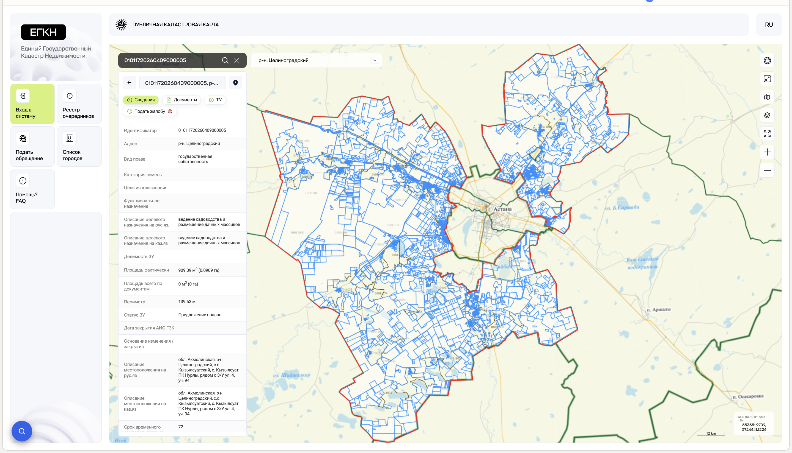
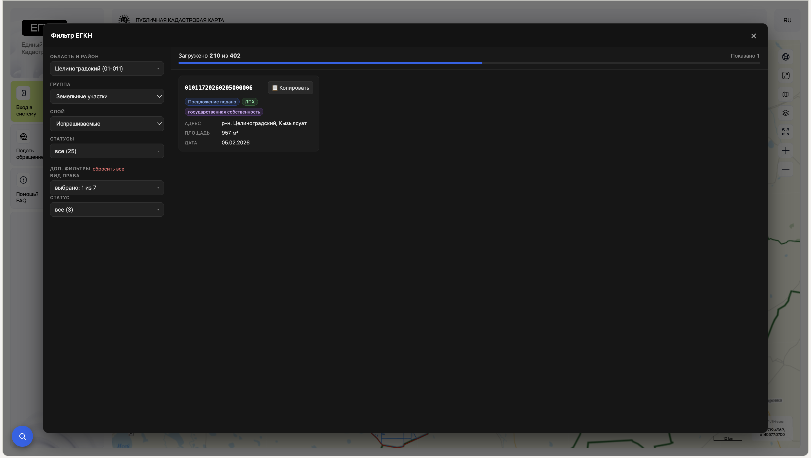
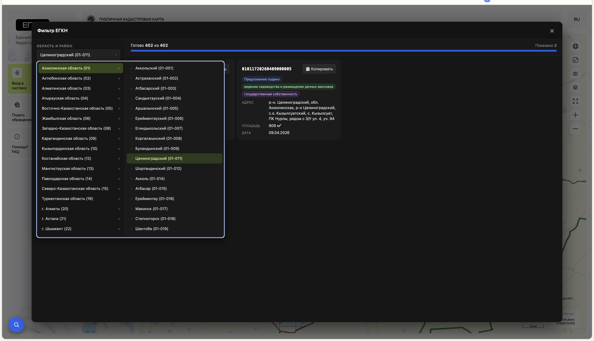

# ЕГКН Фильтр

> Удобная фильтрация и просмотр земельных участков на портале [map.gov4c.kz/egkn](https://map.gov4c.kz/egkn/) — без бесконечного кликанья по карте.

[](./LICENSE)
[](https://developer.chrome.com/docs/extensions/mv3/intro/)
[](https://react.dev/)
[](https://www.typescriptlang.org/)

---

## Зачем это

Я искал землю под ЛПХ и под госсобственностью на сайте ЕГКН (Единый государственный кадастр недвижимости РК) и быстро понял, что штатный интерфейс **не предназначен** для системного перебора участков:

- участки видны только на карте, **сводного списка нет** — приходится кликать по каждому полигону по очереди;
- нельзя одной операцией посмотреть **все** свободные участки по району;
- нет фильтров по виду права или статусу — нужно открывать каждую карточку руками;
- ID участков нельзя скопировать одним кликом — выделяешь вручную.

После пары вечеров такого «исследования» я сделал расширение, которое решает это за меня. Делюсь — вдруг кому-то ещё пригодится.

## Как это выглядит

**До:** штатный сайт ЕГКН — участки только на карте, нужно кликать по каждому полигону.



**После:** панель расширения со списком, фильтрами, прогрессом загрузки и кнопкой копирования ID.



**Каскадный выбор области и района** — все районы, города и посёлки одним списком.



## Что умеет

- 🗺️ **Авто-подстановка района** из вашей сессии ЕГКН — не нужно искать вручную.
- 📋 **Полная загрузка всех страниц** выбранного слоя с прогресс-баром (`загружено 210 из 402`).
- 🔍 **Двухуровневая фильтрация:** по статусу из справочника + по property-полям (вид права, статус) с подсчётом значений.
- 🏷️ **Карточки участков** с адресом, площадью, датой, видом права, способом аукциона, стартовой ценой — поля адаптируются под тип слоя.
- 📑 **Пагинация** результатов (5 карточек на страницу).
- 📋 **Копирование ID** участка в буфер одним кликом.
- 🚀 **Кэш на всю сессию** — повторное открытие района или слоя мгновенное.
- 🛡️ **Ничего не отправляется наружу** — расширение использует те же публичные REST-эндпоинты, что и сам сайт ЕГКН.

## Установка для пользователей

Подробная пошаговая инструкция — [docs/setup.md](./docs/setup.md).

Если коротко:

1. Скачайте архив сборки со страницы [Releases](https://github.com/Narimannmn/egkn-filters/releases) и распакуйте.
2. Откройте `chrome://extensions`, включите **«Режим разработчика»**.
3. Нажмите **«Загрузить распакованное»** → выберите распакованную папку.
4. Откройте [https://map.gov4c.kz/egkn/](https://map.gov4c.kz/egkn/) — в левом нижнем углу появится кнопка 🔍.

Работает в **Chrome / Edge / Brave / Opera / Yandex Browser**. В Safari — нет.

## Установка из исходников

Если на странице Releases нет сборки или хотите собрать сами:

```bash
git clone https://github.com/Narimannmn/egkn-filters.git
cd map
pnpm install
pnpm build
```

Готовая сборка появится в папке `dist/` — её и нужно загрузить через **«Загрузить распакованное»**.

> Требования: Node.js ≥ 18, pnpm ≥ 8 (`npm i -g pnpm`).

## Разработка

```bash
pnpm dev      # vite dev server с HMR
pnpm build    # типы + сборка в dist/
```

Полный гайд для контрибьюторов — [docs/contributing.md](./docs/contributing.md): структура проекта, архитектурные решения, как добавить новый слой или новый фильтр.

## Стек

- **Manifest V3** Chrome content script
- **React 19** + **TypeScript 5.5**
- **TanStack Query v5** — стриминговая загрузка слоя волнами по 20 параллельных запросов
- **Radix UI** — Dialog, Popover, Checkbox
- **Shadow DOM** — изоляция стилей от хост-сайта
- **Vite 5** + **@crxjs/vite-plugin** — сборка

## Документация

- 📖 [docs/setup.md](./docs/setup.md) — установка для обычного пользователя.
- 🛠️ [docs/contributing.md](./docs/contributing.md) — для разработчиков: структура, стек, как контрибьютить.

## Лицензия

[MIT](./LICENSE) — можно использовать, форкать, модифицировать и даже продавать, при условии сохранения упоминания автора.

---

Если расширение помогло — поставьте ⭐ репозиторию, это мотивирует развивать. Нашли баг или хотите фичу — [откройте issue](https://github.com/Narimannmn/egkn-filters/issues).
